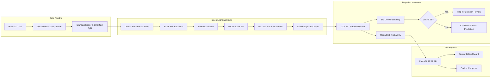
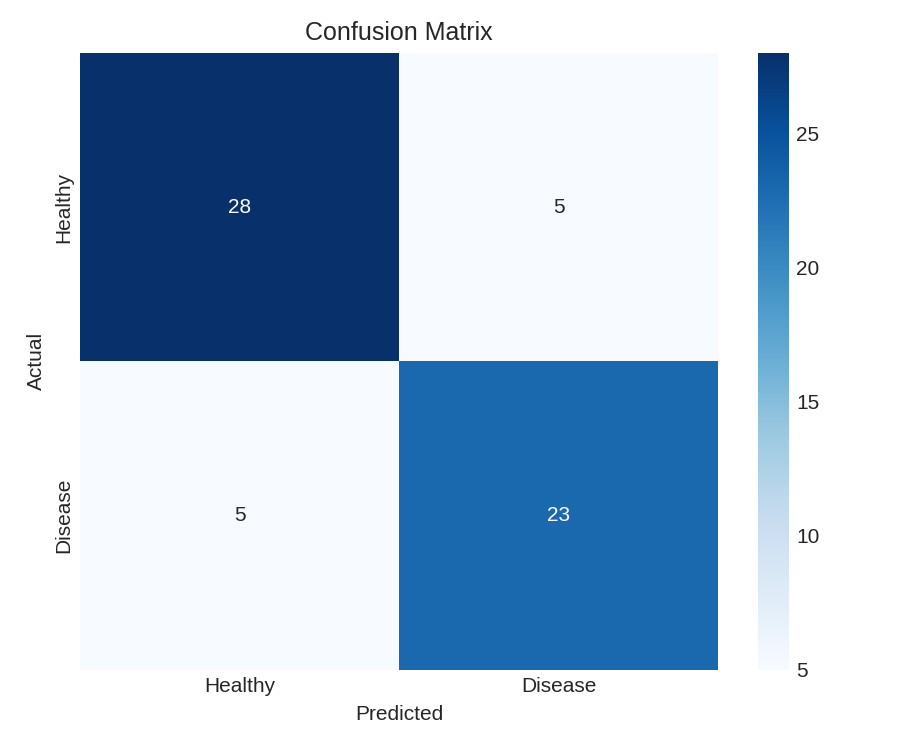
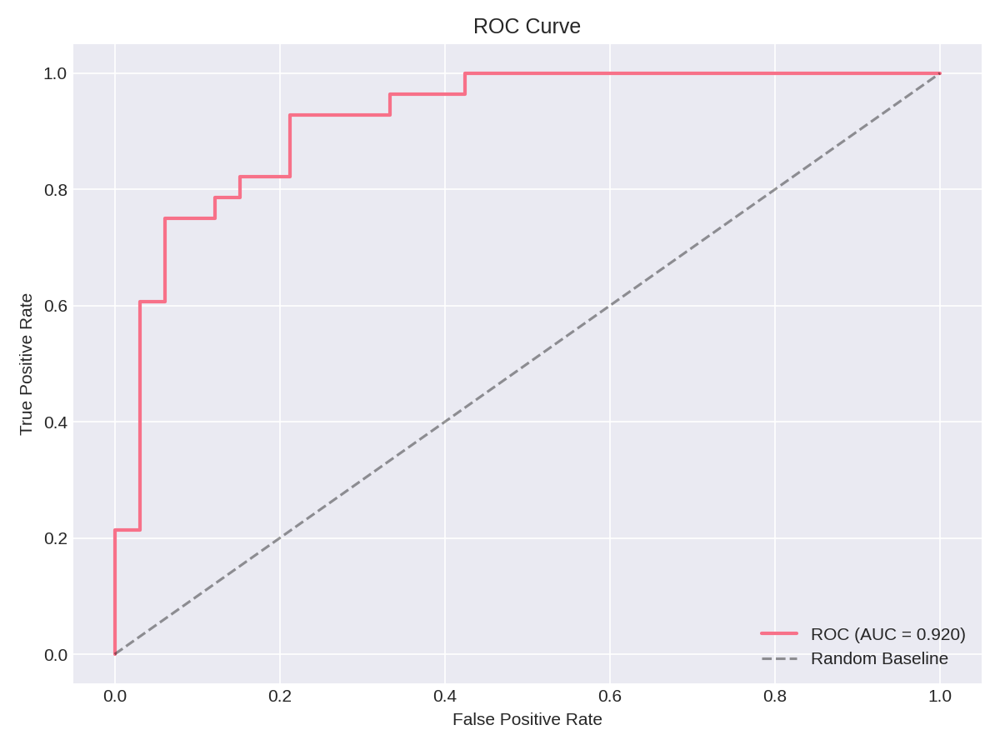
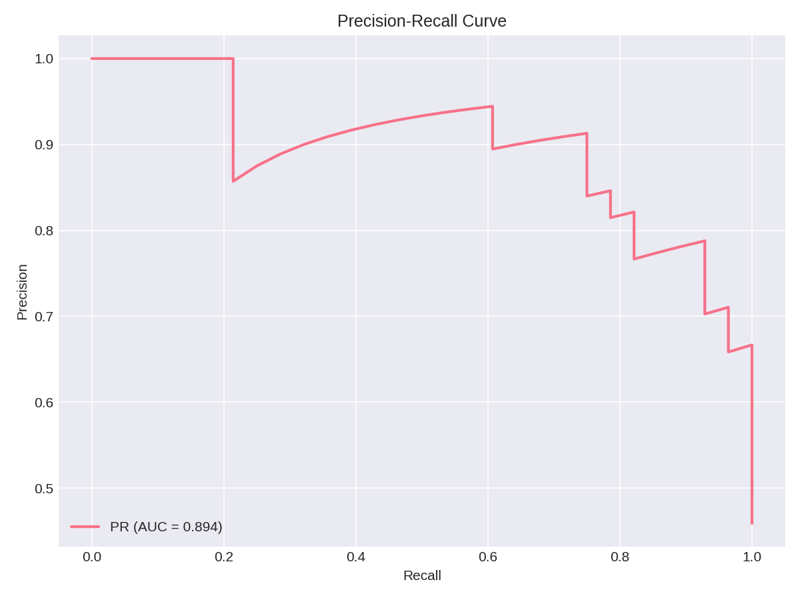
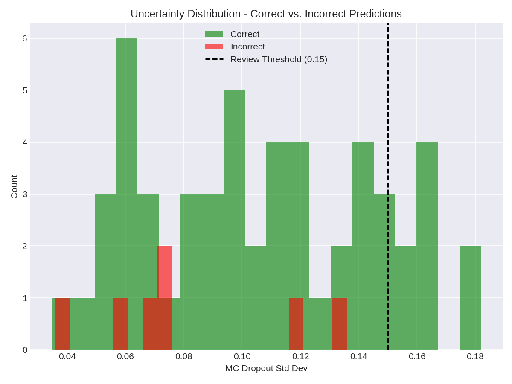

# Clinical Heart Disease Classifier — Bayesian Neural Network

> A production-ready Deep Learning classification system trained on the UCI Heart Disease dataset. This project implements advanced Bayesian **Monte Carlo (MC) Dropout** for clinical uncertainty estimation. It is fully containerized with Docker, exposing a FastAPI REST backend and an interactive Streamlit diagnostic dashboard.

[](https://www.python.org/)
[](https://www.tensorflow.org/)
[](https://fastapi.tiangolo.com/)
[](https://www.docker.com/)

---

## Project Overview

Training a standard neural network on small medical datasets (303 patients, 13 clinical features) typically leads to severe overfitting. This project overcomes the "small-data constraint" by engineering a heavily constrained Multi-layer Perceptron (MLP) architecture tightly regularized to generalize safely. 

Crucially, the model utilizes **Monte Carlo Dropout** at inference time. Instead of outputting a generic probability, the system runs 100 stochastic forward passes per patient, outputting both a **Mean Risk Probability** and an **Uncertainty Score (Standard Deviation)** to flag ambiguous cases for human clinical review.

---

## System Architecture



---

## Key Engineering Decisions

| Technique | Problem Solved | Implementation |
|---|---|---|
| **Bayesian Inference (MC Dropout)** | AI over-confidence | Activating Dropout (rate=0.5) during inference to generate confidence intervals. |
| **Severe Bottleneck Architecture** | Overfitting on tiny datasets | Drastically reduced hidden layer capacity to a single layer of `[8]` units. |
| **Max-Norm Constraint & Dropout** | Weight explosion & memorization | Imposed strict bounded kernel magnitudes (`0.5`) and aggressive feature dropping. |
| **Batch Normalization Scaling** | Training instability / validation noise | Increased batch size to 128 to smooth batch statistics and prevent divergent validation curves. |
| **Swish + Nadam Optimizer** | Dead neurons & suboptimal minima | Combined smooth activations with an annealed exponential learning rate decay. |
| **Modular MLOps Design** | Messy notebook spaghetti code | Completely separated data loading, compilation, and evaluation into scalable `src/` modules. |

---

## Evaluation & Results

Metrics automatically generated against an unseen 20% holdout test set using `make train`. 

* **Test Accuracy:** 83.61%
* **Precision:** 82.14% (Low false-alarm rate)
* **Recall:** 82.14% (High sensitivity to actual positive cases)
* **ROC-AUC:** 0.919 (Excellent class separation)
* **Ensemble MC Accuracy:** **88.52%** (Huge accuracy boost generated by Monte Carlo ensembling!)

### Visual Diagnostics

<details open>
<summary><b>Click to View Interactive Training & Test Metrics</b></summary>
<br>

**1. Confusion Matrix**


**2. ROC & Precision-Recall Curves**
<p float="left">
  
  
</p>

**3. Uncertainty Distribution**

</details>

---

## Quick Start Guide

### 1. Fully Dockerized Deployment (Recommended)
This runs the entire lifecycle automatically. Docker will automatically pull the data, train the baseline model from scratch inside the container, and spin up both the backend API and frontend dashboard.

```bash
git clone https://github.com/your-username/heart-disease-prediction.git
cd heart-disease-prediction

docker-compose up --build
```
* **Dashboard (UI):** [http://localhost:8501](http://localhost:8501)
* **FastAPI Docs:** [http://localhost:8000/docs](http://localhost:8000/docs)

### 2. Local Development setup
```bash
python3.11 -m venv venv
source venv/bin/activate
pip install -r requirements.txt

make train        # Execute data loading, model building, early stopping, and metric generation
make serve        # Launch backend REST API
make dashboard    # Launch interactive Streamlit interface
```

---

## API Integration Example

Query the API seamlessly with patient vitals to receive a probabilistic risk assessment:

```bash
curl -X POST http://localhost:8000/predict \
  -H "Content-Type: application/json" \
  -d '{
    "age": 63, "sex": 1, "cp": 3, "trestbps": 145, "chol": 233,
    "fbs": 1, "restecg": 0, "thalach": 150, "exang": 0,
    "oldpeak": 2.3, "slope": 1, "ca": 0, "thal": 6
  }'
```

**JSON Response:**
```json
{
  "risk_probability": 0.7234,
  "risk_percentage": 72.34,
  "uncertainty_std": 0.0891,
  "requires_review": false,
  "prediction": "Heart Disease Risk",
  "mc_samples": 100,
  "message": "Prediction complete"
}
```

---

## Project Structure

```text
heart-disease-prediction/
├── Dockerfile                  # API Container
├── docker-compose.yml          # Multi-container orchestration
├── Makefile                    # CI/CD & Pipeline execution
├── config.yaml                 # Centralized hyperparameter storage
│
├── notebooks/
│   └── experiments.ipynb       # 📓 End-to-end interactive EDA, training, and correlation matrix
│
├── src/
│   ├── data_loader.py          # automated UCI downloads & scalable transformations
│   ├── model.py                # Bayesian architecture and MCDropout wrappers
│   ├── train.py                # EarlyStopping training loops
│   ├── evaluate.py             # Classification Reports & Visual generation
│   ├── api.py                  # FastAPI server configuration
│   └── dashboard.py            # Streamlit interactive frontend
│
└── results/                    # Auto-generated artifacts & performance visuals
```

---
**License**: MIT 
